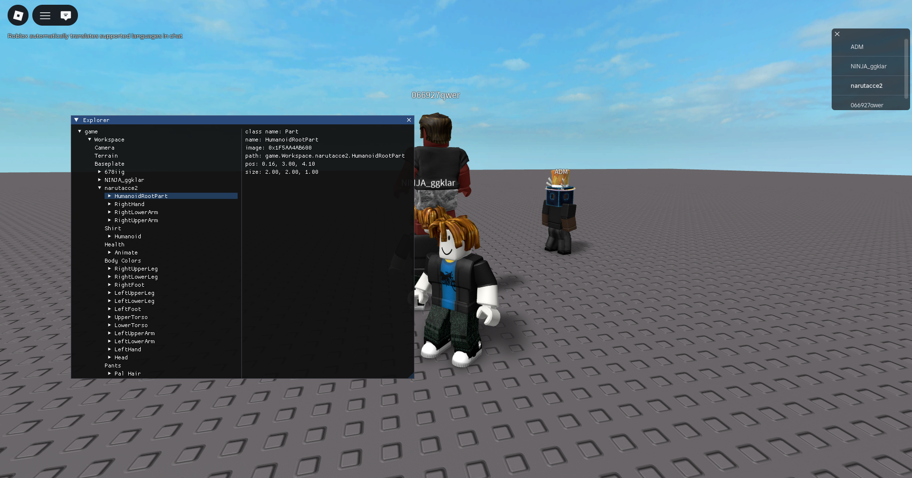

# RoExplorer
Lightweight external DataModel dissector made in C++.
Uses Windows RPM calls for memory reading. I don't have any intentions of going kernel at the moment.
**USE AT YOUR OWN RISK!**

# Credits
- [robloxoffsets.com](https://robloxoffsets.com) for offsets  
- carlgwastaken for window
